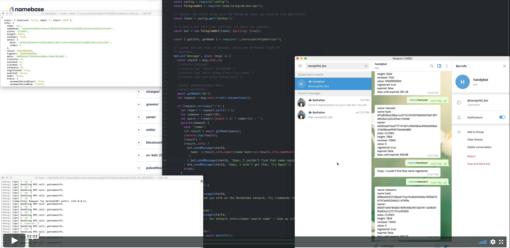

# HandyDNS_Bot
**HandyShake Telegram Bot**

[@HandyDNS_Bot](https://telegram.me/HandyDNS_Bot)

This project was conceived and designed for **Build An Application With Handshake** hackathon. It is live at: [@HandyDNS_Bot](https://telegram.me/HandyDNS_Bot).

HandyDNS_Bot is a telegram bot that will give domain name information from the Handshake network. The initial inspiration of the project was to provide DNS records for domains from the Name Base API:
`/api/v0/dns/domains/:domain`, but that information only appears to be available if the owner queries the record.

The idea of a telegram bot to give domain information was still compelling but without public facing APIs, the challenge increased quite a bit. 

The next step was researching the `hsd` RCP calls.  The information was available from the node, just not for public consumption. The documentation was suprisingly helpful, and the examples presented a clear solution. The calls in question were `getnameinfo` and `getnameresource`. The fact that this information was available, but only from these RPC calls led to running the `hsd` along with the bot. There was a bit of massaging to get the node running along with the bot service, but NodeJS makes things *just* work quite nicely.

Check out a **video** demonstration:

The project is running on an Ubuntu18.04 cloud instance, with PM2 and NodeJS.
The bot can be found at: [@HandyDNS_Bot](https://telegram.me/HandyDNS_Bot)

Shout out to `@ltfschoen` in the discord for that `getnameresource` RPC.